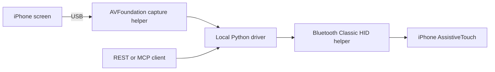

# Architecture

OpenPhone controls a physical iPhone with two independent paths:

The Mac advertises an absolute-pointer and keyboard HID device. Bluetooth Classic
L2CAP control and interrupt channels carry the reports. AssistiveTouch accepts
external pointer input and provides configurable device-button actions, including
Home. A drag holds the primary button while moving the pointer; releasing it
completes the gesture. See [Apple's pointer-device documentation](https://support.apple.com/en-us/111775).

The capture helper opts into CoreMediaIO USB screen devices and opens an
AVFoundation muxed device. It retains the latest frame, drops late frames, and
rejects disconnected or stale capture. No webcam or microphone is opened.

The implementation uses private CoreBluetooth classes and selectors, so macOS
updates can break it. It launches no iPhone-side development agent, WebDriverAgent
or XCUITest process and uses no iPhone Mirroring window or phone accessibility
tree. Developer Mode independence still requires physical validation with that
setting disabled.

Input sequences are serialized and never automatically replayed after a partial
write. A fresh capture and selected-phone guard precede input. Native-pixel
gestures additionally validate screen dimensions. A successful write reports
transport success; callers must inspect the resulting screen to establish that
the intended UI action occurred.

Optional services attach to this mechanism:

- The local dashboard forwards authenticated requests to the local REST API.
- The self-hosted relay queues commands for an outbound Mac worker and persists
  bounded results. Restart fails unfinished commands rather than replaying them.
- MCP adapters expose local and remote phone tools; the HTTP endpoint supports
  bearer credentials and optional durable single-owner OAuth.
- An optional original iPhone Shortcut handles clipboard, app and URL operations.
- Video reads fresh capture independently of the input lock. The WebRTC source
  stops on capture failure. Streaming relay integration is in progress.

All source in this repository is the independent OpenPhone implementation.
Private recordings, research evidence, runtime state and credentials are excluded.
