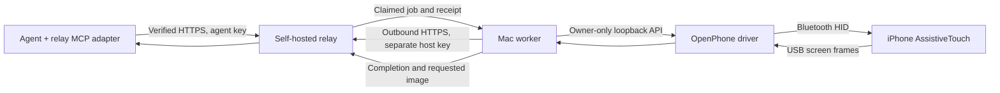

# Self-hosted relay and remote agent access

The relay lets an agent reach a Mac-hosted phone through authenticated HTTPS.
The Mac worker makes outbound requests, executes each claimed job through the
existing loopback API, and returns its result. The relay never loads the native
Bluetooth/capture helpers. The agent needs only its own relay key.

The relay uses HTTP long polling for commands and requested images for
screenshots. The Mac retains capture and Bluetooth ownership.



## Run

Start the normal local REST server on the Mac. Run the relay on a reachable
computer, and run the worker on the Mac with the phone:

```sh
# Mac with the phone
openphone serve

# Relay computer: use a certificate valid for its hostname/IP
openphone relay --host RELAY_IP --cert /path/cert.pem --key /path/key.pem --hostname relay.example

# Mac with the phone
openphone host --url https://relay.example:8768 --phone-id lab-iphone --address AA:BB:CC:DD:EE:FF --host-token-file /path/host-token
```

The relay creates two distinct owner-only files: `.relay-agent-token` and
`.relay-host-token`. Copy the host key to the Mac worker and the agent key to
the agent computer as separate owner-only files. Keep the local `.runtime-token`
on the Mac. Keys are read from files and never printed or passed as command-line
values. The worker and agent do not exchange their keys.

Non-loopback server listeners and client connections require HTTPS. TLS
verification is always enabled. A private CA can be supplied with `--ca-file`
on the worker or `OPEN_PHONE_RELAY_CA` on the agent. The current hardware test
uses an owner-generated, one-day test certificate in ignored `private/` files;
it is a development fixture, not a permanent public deployment.
TLS handshakes run in bounded request threads, so a client that opens TCP without
completing a handshake does not block other agent/host connections.

For a completely local test, the relay's default listener is
`http://127.0.0.1:8768`. Do not start another native driver/MCP instance against
the same phone while the worker's local REST server owns it.

The worker guards every job against its configured Bluetooth address **inside
the local action lock**. If another client selects a different phone, its jobs
fail before any input. Heartbeats check fresh capture and the same target;
capture failure marks the phone offline and fails unclaimed jobs.

## Remote MCP

Run `packages/mcp/src/relay_mcp.mjs` on the agent computer, with explicit environment settings:

```toml
[mcp_servers.open_phone_relay]
command = "node"
args = ["/absolute/path/to/open-phone/packages/mcp/src/relay_mcp.mjs"]
env = { OPEN_PHONE_RELAY_URL = "https://relay.example:8768", OPEN_PHONE_RELAY_TOKEN_FILE = "/path/agent-token" }
```

For the private test CA, add `OPEN_PHONE_RELAY_CA = "/path/relay-cert.pem"` to
that environment. Do not assume the MCP client inherits shell environment vars.

The adapter exposes 13 phone-ID-based tools: phone listing/status, screenshot,
tap, double/triple tap, long press, flick, drag, hold-and-drag, text, keypress,
and Home. It returns JPEGs with longest edge at most 1344 pixels. Pointer
coordinates are pixels in the last returned image. The adapter checks bounds
and converts them once to native pixels for REST. Take a new screenshot after
acting to verify the result and update that coordinate reference.

This entry point is a local stdio adapter to a remote HTTPS service. The optional
[Streamable HTTP endpoint](http_mcp.md) now exposes the same tools directly over
HTTPS using a separate bearer key. Browser OAuth, organizational accounts and
provider login are not yet implemented.

Both transports share session-local screenshot references. Pointer calls require
a screenshot within 30 seconds, map inclusive endpoints to native endpoints and
carry its native dimensions to the driver. Input attempts invalidate the reference.
Repeated accepted tool-call IDs in a session do not execute again, even after a
cached result is evicted. New sessions do not preserve that history.

## REST and jobs

The agent sends `X-API-Key`. The host uses a separate bearer key on its private
register, heartbeat, claim, completion and unregister routes. Browser `Origin`
headers and unrecognized `Host` headers are rejected.

The public routes are `/v1/phones`, per-phone `/status`, `/settings` (PATCH),
`/apps`, `/apps/refresh` (POST), `/screenshot`, and POST actions `tap`,
`double-tap`, `triple-tap`, `tap-and-hold`, `flick`, `drag`, `hold-and-drag`,
`type`, `keypress`, and `home`. `/v1/jobs/ID` polls status and
`/v1/jobs/ID/download` retrieves a completed screenshot. REST coordinates are
native integer pixels. Flick direction means finger movement, so `up` reveals
content farther down a list.

An additional `/v1/phones/ID/action` accepts the allowlisted local driver's
`{method, params}` operations; these retain normalized coordinates. The MCP
adapter uses it for resized JPEG capture. It also permits optional Shortcut
bridge operations when that bridge has been configured on the Mac and phone.
For `shortcut_action`, remote job completion means the Mac enqueued/triggered
the phone action. Its embedded `result.id` is a separate phone action ID; poll
`shortcut_result` until that action completes before pasting or continuing.
It also accepts validated `native_gesture` envelopes with action, parameters and
expected native width/height. MCP uses these to preserve screenshot dimensions
until the Mac checks fresh capture before input.

Actions wait for a completed/failed job by default. `?async=true` returns a job
ID immediately. Jobs have `pending`, `running`, `completed` or `failed` state.
An HTTP 200 action response can contain a failed job; inspect its status and
error. Synchronous screenshot failure returns an HTTP error instead of bytes.

One job per phone can run at a time. Claim creates a private completion receipt;
the same job is not delivered again. A lost completion response stops the worker
without repeating the gesture. Restart/replacement fails the old session's
unfinished jobs. Normal worker shutdown also fails unfinished jobs. A timeout
cannot undo an already executed phone action.

The CLI now uses an owner-only [SQLite ledger](state.md): default execution
deadline 60 seconds, result history up to five minutes/128 records, 32 unfinished
jobs and 32 MB of screenshot bytes. Phone metadata and app cache survive restart;
restored phones start offline and unfinished jobs fail without redelivery.
Use `--state-file` for another database path or `--ephemeral` for memory-only tests.
Older terminal records/images can be evicted when capacity is reached. App
metadata is cached until explicitly refreshed, including across relay restarts. All phones
in this owner-controlled relay are active; there is no subscription gate.

The native-pixel gesture profile uses inclusive endpoint mapping, 100 ms tap
press/release intervals, and drag speeds of 400/800/1400 native pixels per second
for slow/medium/fast. Drag motion has 10 ms steps and smoothstep easing. Flick
travels one third of the native screen extent, clamped to its edges; this relay
chooses medium strength, 180 ms motion. Logical sleeps exclude scheduling and transport overhead.
Fresh capture must match the dimensions used to plan the gesture before input.

Prototype parameter limits include 100 ASCII characters on the public type
route, 20 repeated keypresses, holds at most 2000 ms, and native batches at most
1000 reports/15 seconds. Drag duration depends on distance and speed. The
normalized generic action route retains its earlier configurable profile. Optional
Unicode clipboard operations use the separately configured Shortcut bridge.
Simultaneous multiple-phone hardware operation, internet deployment, orientation
changes and long-term network recovery are still unverified.

## Verified on the attached phone

The HTTPS client rejected the untrusted test certificate, then succeeded with
its explicit CA. A native-pixel REST tap opened Settings. Full-resolution PNG,
async job polling/download, Home and cached 333-entry app inventory worked.
The SDK client discovered all 13 relay MCP tools, received a 621 × 1344 JPEG,
and a tap chosen from that image opened Settings on the 1180 × 2556 phone.
Missing screenshots and out-of-image coordinates were rejected before input.
A wrong local expected phone address was rejected and the phone stayed on Home.
The optional Shortcut copy/read also passed through the relay with exact Unicode
text and distinct relay-job/phone-action IDs.

The updated native-pixel profile also opened Spotlight and Settings. A 1,000-pixel
medium drag used 1,250 ms of motion and visibly scrolled the Settings list; an
upward flick used 180 ms of motion and visibly advanced farther down the list.
The latest SDK run passed inventory, images, Home and bounds rejection, but its
reviewed tap was interrupted by unavailable USB capture and was not completed.

```sh
node packages/mcp/tests/relay_mcp.mjs
OPEN_PHONE_RELAY_URL=https://RELAY_IP:8768 OPEN_PHONE_RELAY_CA=/path/test-ca.pem node packages/mcp/tests/relay_mcp.mjs --hardware lab-iphone --review-tap
```

Run the optional review test in an interactive terminal. It pauses for at most
60 seconds after saving its Home image. Inspect that image, then enter `TAP x y`
for a safe visible target in its returned image coordinates. It records the
result as `relay-mcp-tap.jpg`; inspect that image to confirm the intended UI
result. Closed input or a missing target fails the check without sending a tap.
Hardware screenshots and job results are in the private research evidence directory.
